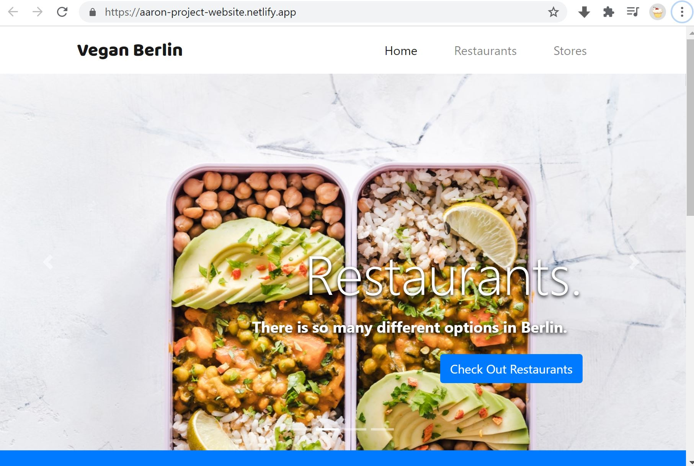

# My Favourite Vegan Restaurants

## Description

The more advanced end of my react abilities allowed me to create a website which shows some of my favourite restaurants.

## Technologies 
- react
- react-reveal animations
- react-router
- html
- css 
- javascript

## Additional Info

Students who are interested to learn some real use cases for load on scroll effects, animations, declarative routing and using context in react!

 ## 🛠️ Commands
 
 ` git clone https://github.com/aar9nk/Vegan-Berlin.git`
 
 `cd Vegan-Berlin`
  
 `npm install`
 
 `npm start`
 
 ## Check it out!
 
 https://aaron-project-website.netlify.app
